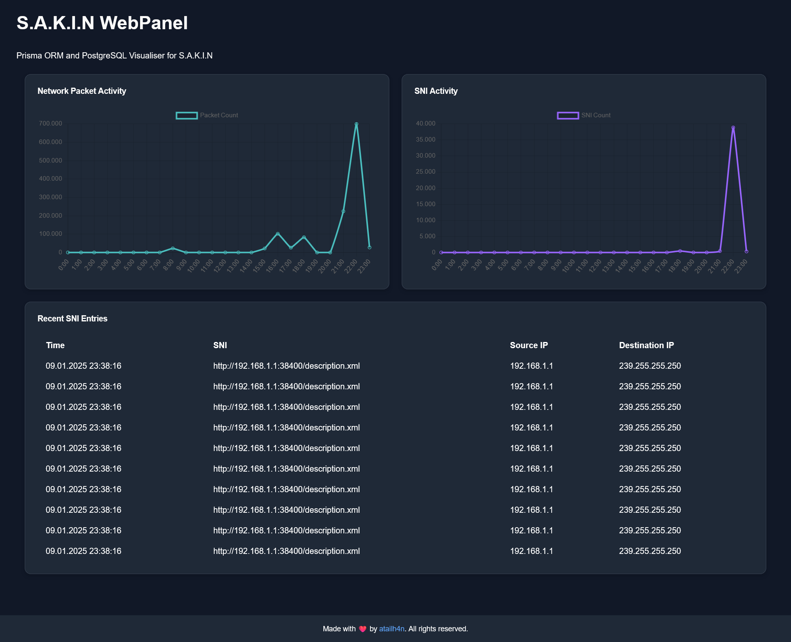

#  S.A.K.I.N WebPanel

  
  
  

S.A.K.I.N WebPanel, developed as a continuation of the [S.A.K.I.N](https://github.com/atailh4n/sakin) project.

This WebPanel is built with [Next.js](https://github.com/vercel/next.js) and Prisma ORM. Its purpose is to display data saved to PostgreSQL by the S.A.K.I.N backend.

---

## 🛠️ Setup

#### Step 1: Clone the repository from Git

#### Step 2: Install the necessary packages

#### Step 3: Create the `.env` file in the project folder

---

### You are ready to go! Now, start the project with:

---

## License

This project is licensed under the MIT License.  
Made with 💙 by Ata İlhan Köktürk.

---

## Contribution

Feel free to open issues or contribute to the project!

---

## Contact

You can find me and my socials here: [Click here to visit my profile](https://github.com/atailh4n).
